# MoneyApp

**A local-first personal-finance and net-worth app that never sees your credentials.** No Plaid,
no aggregators, no cloud. You feed it the statement files your banks already give you — CSV,
OFX/QFX, and PDF — and it reconstructs a continuous two-year history of your net worth, spending,
income, budgets, subscriptions, and forecasts. Every statement must reconcile to the cent
(`beginning + Σ transactions = ending`) or it is quarantined with its exact gap, so the numbers
you see are numbers you can trust. It runs entirely on your machine against a single SQLite file;
the only optional network calls are free price APIs and (if you add a key) batched Claude calls to
classify brand-new merchants — which are cached forever, so the model is asked about each merchant
exactly once.

> Everything in the screenshots below is **synthetic demo data** — a deterministic 24-month
> simulated financial life rendered into byte-realistic Chase/Discover/Capital One/SoFi/Robinhood
> statement files (256 of them), then pushed through the exact same ingestion pipeline your real
> statements would use. `pnpm demo:load` rebuilds all of it in one command.

## Live walkthrough

**1 — First launch: the empty ledger.** Local database created, migrated, and seeded on boot;
a crash-safe snapshot is taken via SQLite's online backup API.

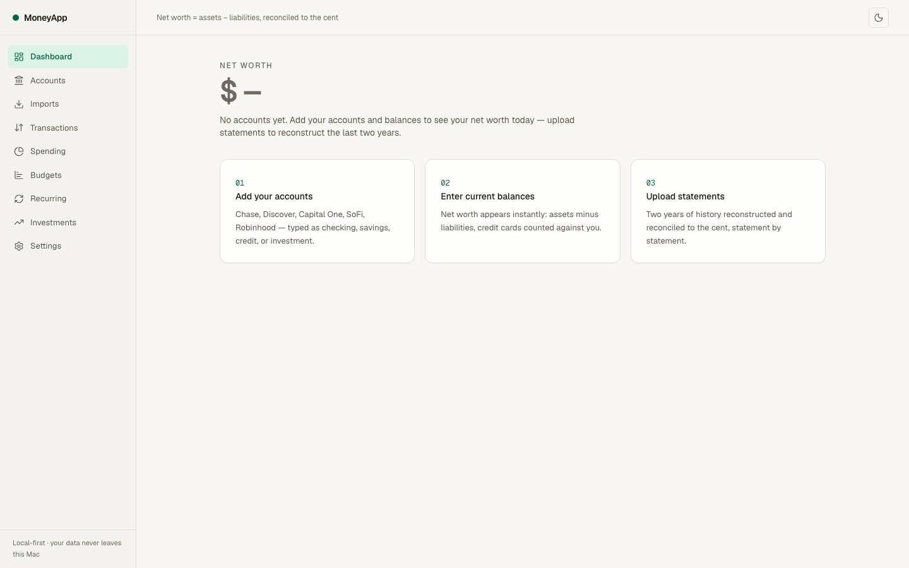

**2 — Drop statement files onto the Imports page.** Here a Capital One OFX export, a card CSV, and
five monthly statement PDFs were uploaded through the browser. Accounts are detected and created
automatically; every statement period reconciles to the cent before it counts.

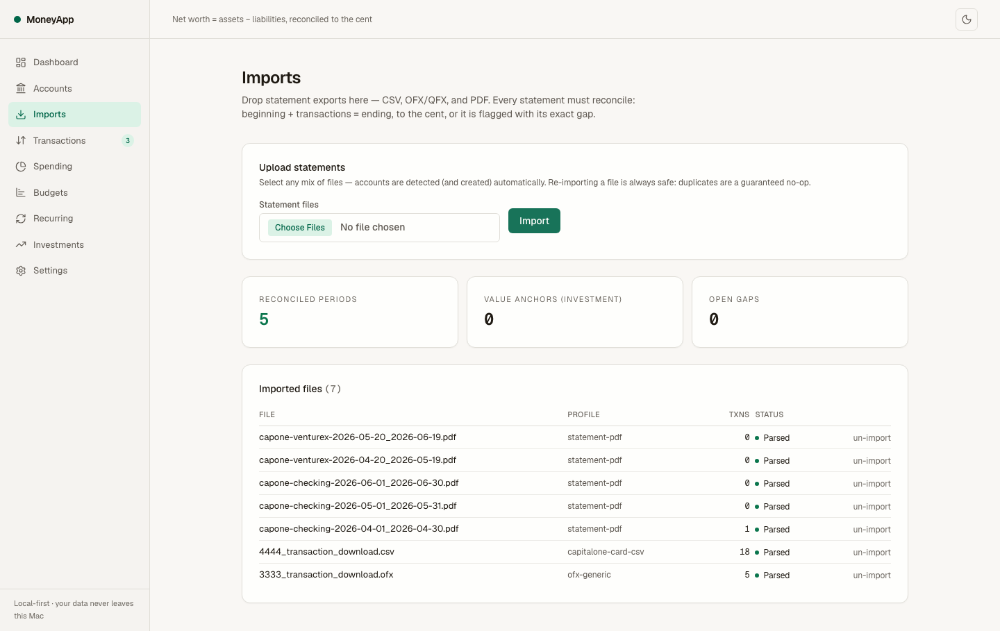

**3 — The trust layer catches a corrupted statement.** This PDF lists transactions that don't sum
to its printed balances (a missing row). The gap is computed to the cent — $195.50 — the period is
flagged, and its transactions are quarantined out of every analytic until you re-import a corrected
file or accept the statement as-is.

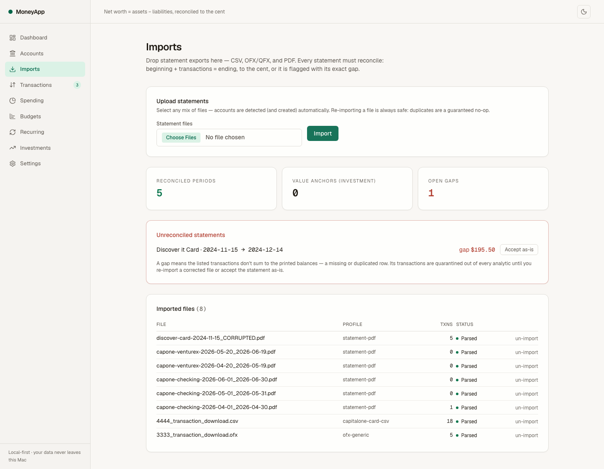

**4 — Two years of net worth, reconstructed from 256 files.** Balance anchors from statement PDFs +
transaction replay between them = a continuous daily curve per account (you can see individual
paydays in the staircase). The dashed prefix marks backward-derived history with no closing anchor —
the chart never invents a level it can't verify. Credit cards count negative; net worth = assets −
liabilities.

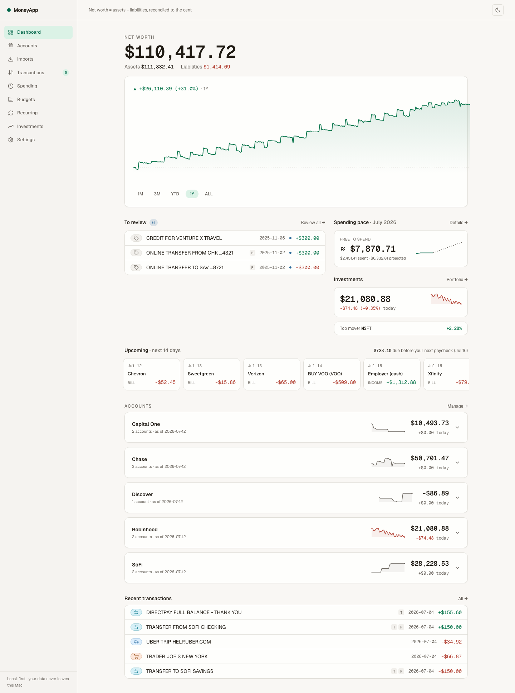

**5 — 1,673 transactions, 96% auto-categorized without a single AI call.** The seeded merchant map +
user rules do the bulk for free; the header strip tracks coverage, the review queue, and the queue of
unknown merchants waiting for (optional, batched) Claude classification. Corrections update the map
permanently — with a direction guard so a one-off refund can never silently flip a merchant's category.

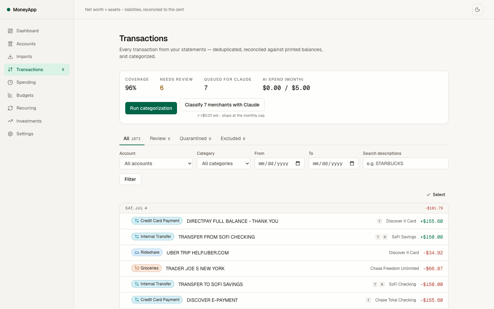

**5b — Categorize the backlog one card at a time.** The review queue opens a focused card per
flagged transaction, with a progress counter as you sweep. Each card carries a one-tap category
suggestion (a matching rule → the merchant's default → what similar transactions were called), the
merchant's spend history (sparkline, count, average, total, and a by-account split when it spans
accounts), the same-merchant group with a one-gesture "recategorize all past & future," and the
auto-rules that already fire on it. Setting a category auto-advances — the engine learns your intent
as you go, no bulk-editing spreadsheet required.

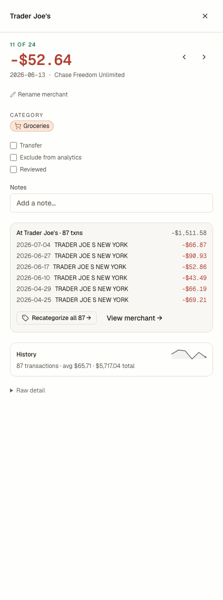

**6 — Spending analytics that reconcile exactly.** Stacked monthly categories, trends, and an income
view; every number on screen links to the filterable transaction list that produces it. Transfers,
rewards, and investment flows are excluded by construction — uncategorized spending is shown as its
own explicit bucket, never hidden.

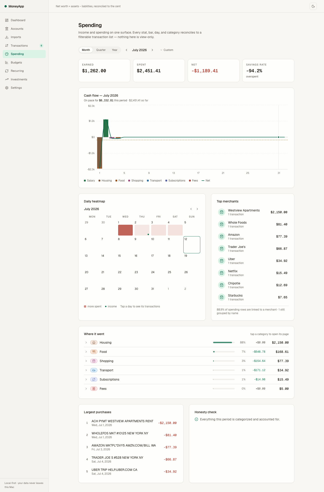

**7 — Budgets that pace, not just alert.** Daily, weekly, monthly, and annual budgets per category,
each bar coloured green → amber → red by its *projected* end-of-period pace — spend-to-date, plus the
recurring charges still to post (the hollow tail), plus an extrapolated variable remainder — with a
"today" tick so you read ahead-or-behind at a glance. Housing here is already over; Food is on pace
to overrun. Edit the amount inline against a 6-month average; subcategory spend rolls into parent
budgets without double-counting the totals, and leftover is visible but never rolls over.

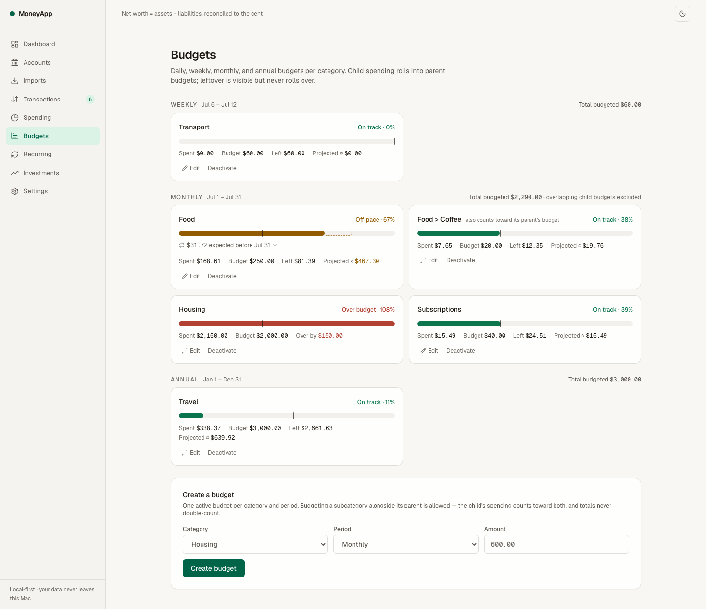

**8 — Recurring detection + a forecast that shows its math.** Salary, rent, and subscriptions are
detected from cadence + amount stability (statistics stored on the series, not a black box), and the
end-of-month forecast expands into every fixed and variable component that sums to it.

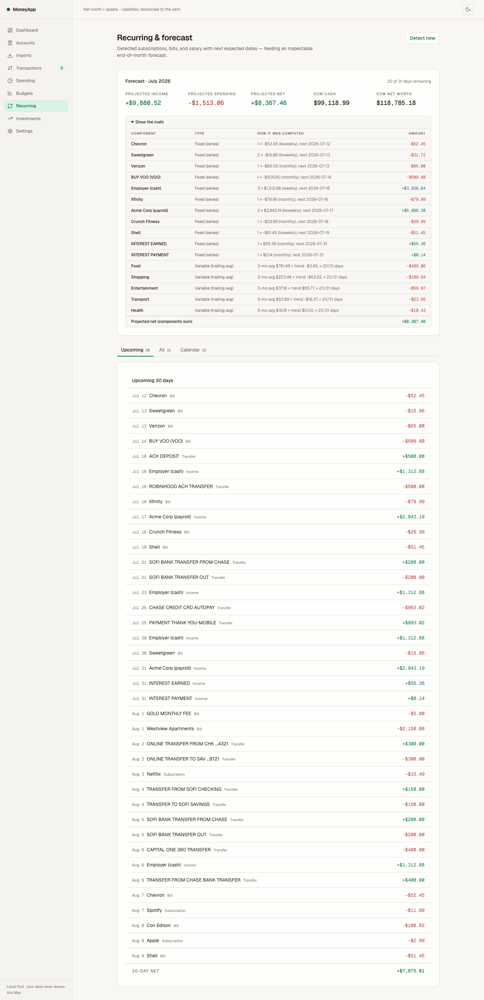

**9 — Holdings with live prices and allocation.** Stocks/ETFs via Yahoo, crypto via Coinbase's public
API — both free, both cached in SQLite so the two-year history is fetched exactly once. Market value
drives net worth; average cost is only for P/L.

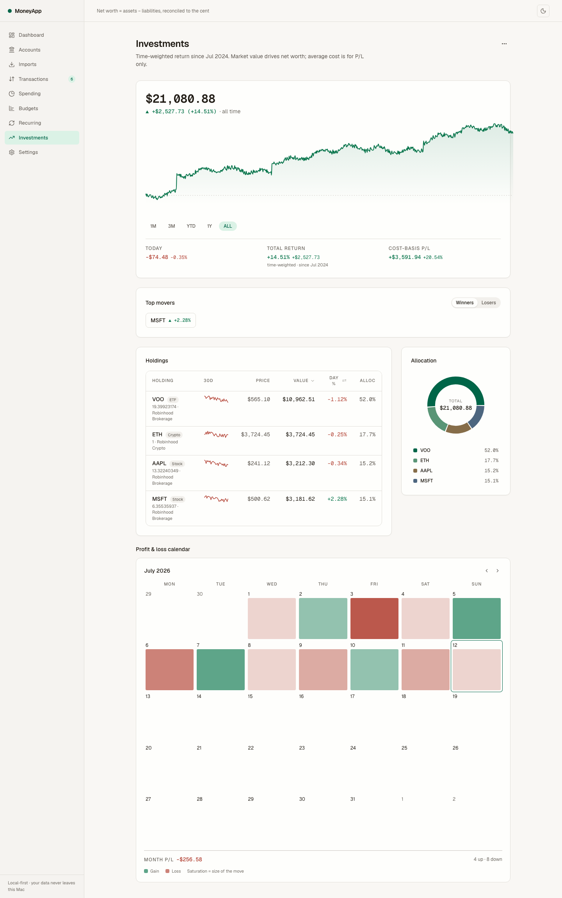

**10 — The import ledger.** All 256 files with their parser profiles, transaction counts, and
statuses; any file can be un-imported atomically. One accepted gap, zero unexplained ones.

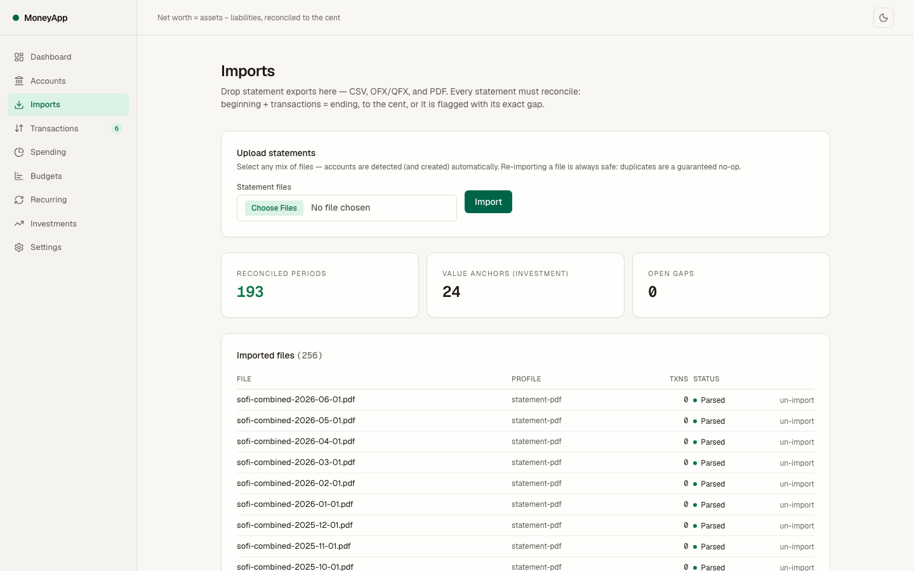

**11 — Dark mode is a first-class theme,** not an afterthought — same token system, same WCAG AA
contrast gates (enforced by axe in CI-able E2E tests).

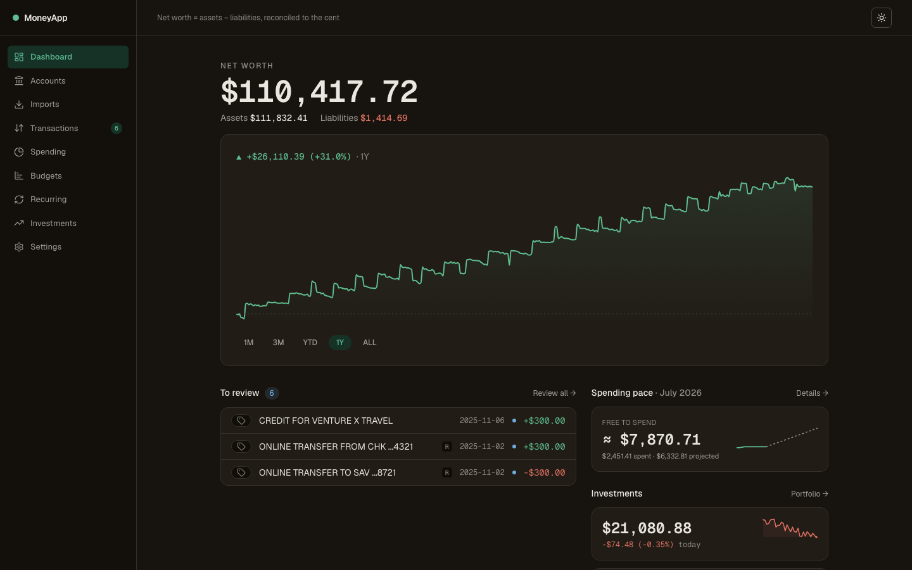

## Architecture

```
                         ┌──────────────────────────────────────────────┐
 statement files ──────► │ INGESTION (the trust layer)                  │
 CSV · OFX/QFX · PDF     │  sniff → parser profile → canonical txns     │
                         │  ownership (OFX>CSV>PDF) → hash dedupe       │
                         │  statement periods → reconciliation          │
                         │  begin+Σ=end ✓ → anchors   ✗ → quarantine   │
                         └───────────────┬──────────────────────────────┘
                                         ▼
   ┌───────────────────────────── SQLite (one file, WAL) ─────────────────────────────┐
   │ accounts · transactions · balance_anchors · daily_balances (derived) ·           │
   │ statement_periods · merchants+aliases (the learning) · rules · budgets ·         │
   │ recurring_series · holdings+holding_events · price_cache · ai_calls · settings   │
   └──┬───────────────┬───────────────┬───────────────┬───────────────┬───────────────┘
      ▼               ▼               ▼               ▼               ▼
  DERIVATION      CATEGORIZE      ANALYTICS       RECURRING        PRICES
  anchors +       rules → map →   spending/       cadence stats →  Yahoo/Coinbase
  replay →        credit-match →  income, exact   inspectable      → cache → live
  daily curve     Claude (rare)   reconciliation  forecast         anchors
      └───────────────┴───────────────┴───────────────┴───────────────┘
                                      ▼
                     Next.js App Router UI (server components,
                     server actions, URL-as-state, Recharts)
```

Everything composes through one approved schema (`docs/schema.md`). Services are pure functions
over the database; the UI is a thin layer that can't invent numbers.

## Technical deep-dive

**The hardest call: making reconciliation the load-bearing wall — and scoping it per account type.**
The naive design ("`begin + Σtxns = end` for every statement") fails catastrophically for brokerage
accounts, where market movement isn't a transaction: every Robinhood statement would quarantine, and
your dividends would silently vanish from income analytics. An adversarial review caught this before
a line of code was written. The shipped design has two identities: cash/credit statements must close
to the cent; investment statements are *value anchors* where `market_change = end − begin − Σ(cash
flows)` is computed and displayed, never treated as an error. The corrupted-statement demo above is
the other half of the same wall: a statement whose rows don't sum parses *successfully* and then
fails reconciliation — because a parse error would hide the problem, while a quarantined gap makes
the bank's error (or the parser's) visible and actionable.

**The alternative we rejected: forking an existing app.** Actual Budget, Firefly III, and Maybe were
all considered as skeletons. They were rejected because the core of this design — anchor-chained
backfill, statement-grade reconciliation with quarantine, format-priority ownership across
overlapping files — is precisely what none of them have, and their budget-first schemas fight it.
We stole their best proven pattern instead: the tolerant hand-rolled OFX parser (~150 lines,
modeled on Actual's production `ofx2json`) because bank OFX is SGML tag soup that breaks every
"proper" XML parser, and the npm OFX ecosystem is effectively unmaintained.

**Details you can't guess from the summary:** dedupe hashes are computed over the *raw* description
(not the normalized one) with a length-prefixed canonical encoding — the normalizer must be free to
evolve weekly without ever double-importing an overlapping export, and a hostile description
containing the field separator can't forge another row's identity. Same-day identical transactions
get a deterministic per-file occurrence index, so a truncated re-export collides with the right row
instead of inserting a phantom third coffee. Overlapping sources are resolved by fidelity ownership
(OFX > CSV > PDF) with content-matched takeover that preserves your manual categorizations —
`import order is provably irrelevant` is an invariant with its own test. Money is integer cents
end-to-end (bank amounts never pass through floats); ledger writes ride better-sqlite3's
*synchronous* transactions (the deciding factor over Prisma); and the price cache is keyed by
`(symbol, asset_type)` because bare `ETH` is simultaneously Ethereum and a NYSE ticker — a
collision that would silently misprice a crypto holding with an equity quote.

## Install & run

Requires Node ≥ 20 and pnpm (built on Node 25 / pnpm 10, macOS).

```bash
git clone https://github.com/rayancheca/moneyapp.git
cd moneyapp
pnpm install                       # native better-sqlite3 build is pre-approved in package.json
pnpm db:migrate                    # create + migrate + seed data/moneyapp.db
pnpm dev                           # http://localhost:3000
```

Try it with the full synthetic demo (2 years, 10 accounts, 256 statement files). `demo:load` rebuilds
its target from scratch (deleting it first), so it **refuses to clobber an existing database** — build
it into a throwaway file and point the app there, keeping any real data untouched:

```bash
MONEYAPP_DB_PATH=data/demo.db pnpm demo:load   # 256 fixtures → the real import pipeline
MONEYAPP_DB_PATH=data/demo.db pnpm dev          # http://localhost:3000
# (to overwrite the default db on purpose: MONEYAPP_DEMO_FORCE=1 pnpm demo:load)
```

Use it with your real statements: export CSV/OFX/QFX activity **and monthly statement PDFs** from
your banks' websites, then drag them onto the **Imports** page. Statement PDFs matter — they carry
the printed balances that reconciliation anchors on.

Optional AI categorization for merchants the seed map doesn't know:

```bash
cp .env.example .env.local         # add ANTHROPIC_API_KEY
```

Without a key the app is fully functional — unknown merchants queue up and the Transactions page
shows the count. With a key, one button classifies them in batches (Haiku, ~50 merchants per call,
every call logged with cost against a monthly cap you set in Settings).

### Tests

```bash
pnpm test               # 290+ unit/integration tests + coverage gates (100% on core utilities)
pnpm build && pnpm e2e  # 85 Playwright tests: 64 visual baselines, 16 axe scans, golden path
pnpm fixtures           # regenerate the synthetic statement corpus deterministically
```

The golden acceptance test imports all 256 fixture files and asserts: zero parse failures, zero
unexplained reconciliation gaps across ~217 statement periods, and per-account balances equal to
the simulator's ground truth **to the cent**.

## Usage examples

Import outcome for a batch (what the Imports page renders):

```
3333_transaction_download.ofx   ofx-generic         parsed   +5 txns   ledger anchor 2026-07-05
capone-checking-2026-04.pdf     statement-pdf       parsed   +1 txn    2026-04-01→04-30 reconciled to the cent
discover-...-CORRUPTED.pdf      statement-pdf       parsed   +5 txns   2024-11-15→12-14 GAP −$195.50 → quarantined
```

The forecast's "show the math" panel (every number is a visible addend):

```
FIXED     Employer (cash) — weekly Thu       +$1,262.00 × 3 remaining
FIXED     Westview Apartments rent            −$2,150.00 × 0 remaining (paid the 1st)
FIXED     Netflix · Spotify · Crunch          −$59.47
VARIABLE  Food (3-mo avg + trend, 23/31 d)    −$412.87
VARIABLE  Transport                           −$118.20
────────────────────────────────────────────────────────
Projected end-of-month cash                  $42,118.66
Projected end-of-month net worth            $111,203.41
```

## Repo map

```
src/lib/          money · dates · dedupe-hash · normalizer · OFX parser · fake price walk
src/db/           Drizzle schema (18 tables) · migrations · seed (taxonomy + merchant map) · backup
src/services/     derivation · import pipeline + parser profiles · categorize · analytics ·
                  budgets · recurring · forecast · prices · holdings · crypto-history · settings
src/app/          Next.js App Router pages + server actions (one directory per surface)
scripts/fixtures/ deterministic 24-month simulator + institution-exact renderers (CSV/OFX/QFX/PDF)
scripts/demo/     demo loader + screenshot driver
docs/             master plan · approved schema · export checklist · research digest · screenshots
tests/fixtures/   the generated synthetic statement corpus (committed; fully fake)
```

## Privacy model

Your data never leaves your machine. The app binds to 127.0.0.1, statements live in `data/`
(gitignored), and the database is a file you can copy, back up, or delete. The three optional
external calls are: Yahoo Finance (stock quotes), Coinbase's public API (crypto prices), and the
Anthropic API — which receives only the normalized transaction descriptions of unknown merchants
(these can include payee names) plus your category names; never amounts, balances, dates, or
account numbers. All three are off until you use them, and AI spend is hard-capped monthly.

Built module-by-module against an approved plan (`docs/master-plan.md`) with an adversarially
reviewed schema (`docs/schema.md`) — 40 review findings were adjudicated before the first line of
application code.
